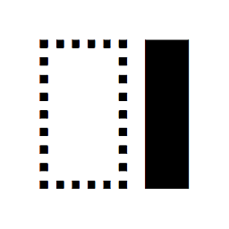

# NocturneShift

**Transform your website's visual experience with the flip of a switch.**

NocturneShift is a sleek and powerful JavaScript plugin designed to seamlessly toggle dark mode across your website. Leveraging a sophisticated blend of CSS manipulations and sessionStorage, it introduces an immersive dark theme to your users without compromising the website's performance or aesthetics.

## Key Features

- **Instant Visual Transition:** Utilizes CSS and JavaScript to instantly apply an 'invert(1)' filter, offering an immediate transition to dark mode for the entire webpage, including predefined classes for images and icons.
- **Session-Based Persistence:** Remembers the user's preference using sessionStorage, ensuring a consistent experience during their browsing session.
- **Smooth Animations:** Incorporates smooth transitions to avoid abrupt changes, enhancing the user's visual experience.
- **Easy to Toggle:** With a simple click on elements marked with the 'darkmode' class, users can toggle the dark theme, making it incredibly user-friendly.
- **Cookie-Free Preference Storage:** Unlike other plugins that rely on cookies, NocturneShift uses sessionStorage for a faster and more secure way to store user preferences.

## Getting Started

NocturneShift is easy to integrate and requires minimal setup. Include the `NocturneShift.js` file in your project, and you're ready to offer a dynamic dark mode to your users. Check out our documentation for detailed instructions and customization options.

## Why NocturneShift?

In the era of digital eye strain, offering a dark mode on your website is not just a feature; it's a necessity. NocturneShift provides an elegant solution, allowing your website to stand out and offering your users the comfort and choice they deserve.

## How to use?

To activate the dark mode feature with NocturneShift, you must assign the class `darkmode_object` to an element (or multiple elements) on your webpage, like so: `class="darkmode_object"`. This will serve as the trigger for enabling dark mode. Upon activation, NocturneShift applies a CSS filter invert(1) to the entire page, effectively switching the visual theme to dark mode. This choice is persistently stored using sessionStorage, ensuring that the user's preference for dark or light mode is retained throughout their browsing session.

Furthermore, if there are specific elements on your page that you wish to exclude from the dark mode inversion effect, you can simply add the class `x-nocturne` to those elements, like this: `class="x-nocturne"`. This class signals NocturneShift to maintain the original color and styling of the element, thereby providing you with the flexibility to fine-tune the dark mode appearance on your website.

**Join the Night Shift with NocturneShift.**
